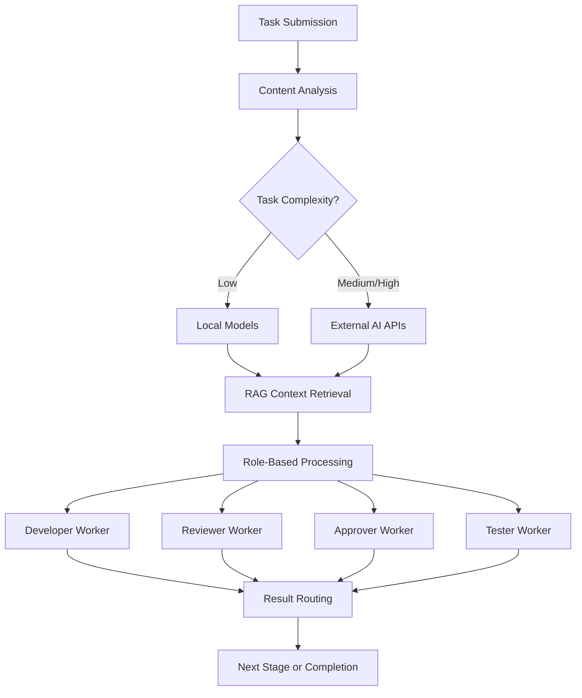

# MQTT Agent Orchestration System


## Overview

**Autonomous AI agent orchestration system** built with Go 1.24+ that orchestrates specialized AI workers through MQTT messaging. The system integrates local GGUF models with external AI APIs, uses Qdrant for RAG knowledge management, and follows strict **"Excellence through Rigor"** design principles.

### Core Philosophy

This system embodies five fundamental design principles:
- **Excellence through Rigor**: Every component built with reliability focus
- **Do More with Less**: Efficient resource utilization and optimization
- **Fail Fast, Fail Loud**: Immediate error detection with clear diagnostics
- **Never Hard Code Values**: All configuration externalized and environment-agnostic
- **Single Responsibility**: Each component has one well-defined purpose

### Key Capabilities

- **🤖 Role-Based AI Workers**: Specialized agents (Developer, Reviewer, Approver, Tester) with distinct capabilities
- **🧠 Intelligent AI Routing**: Automatic selection between local GGUF models and external APIs based on task complexity
- **📚 RAG Knowledge Management**: Comprehensive knowledge base using Qdrant with 2560-dimensional Qwen3 embeddings
- **⚡ GPU Memory Optimization**: LRU cache management for local models with intelligent memory allocation
- **🔧 MCP Tool Integration**: Standardized Model Context Protocol for external tool access
- **📡 MQTT Orchestration**: Asynchronous, scalable communication with QoS=1 reliability

## System Architecture

### Workflow Orchestration

```
┌─────────────────────────────────────────────────────────────────────┐
│                    External AI APIs (configs/ai_helpers.toml)       │
│  • Cerebras (gpt-oss-120b, qwen-3-coder-480b) - Fast reasoning     │
│  • NVIDIA (nemotron-super-49b, OCR models) - High-quality analysis │
│  • Gemini (2.5-pro, 2.5-flash) - Multimodal + large context      │
│  • Grok (grok-4-0709, grok-3) - Creative solutions               │
│  • Groq (kimi-k2-instruct, llama-3.3-70b) - Ultra-fast inference │
└─────────────────────────────────────────────────────────────────────┘
                                      ▲
                                      │ Intelligent routing
                                      │ based on complexity
                                      ▼
┌─────────────────┐    ┌─────────────────┐    ┌─────────────────┐
│   Role Workers  │◀──▶│   MQTT Broker   │◀──▶│   Client Apps   │
│ • Developer     │    │   (Mosquitto)   │    │ • CLI Client    │
│ • Reviewer      │    │ • QoS=1 delivery│    │ • HTTP Server   │
│ • Approver      │    │ • Topic routing │    │ • Test Server   │
│ • Tester        │    │ • Persistence   │    │                 │
└─────────────────┘    └─────────────────┘    └─────────────────┘
         │                                              │
         ▼                                              ▼
┌─────────────────────────────────────────────────────────────────────┐
│                    Local GGUF Models (configs/models.yaml)          │
│  • Qwen2.5-Omni-3B (text generation, 3GB GPU memory)             │
│  • Qwen2.5-VL-7B (multimodal, 4GB GPU memory)                    │
│  • LLaVA-Llama-3-8B (multimodal, 4GB GPU memory)                 │
│  • MiMo-VL-7B (multimodal, 4GB GPU memory)                       │
│  • Qwen3-Embedding-4B (2560-dim vectors, 2GB GPU memory)         │
│  ↓ LRU Cache Management (GPU memory optimization)                 │
└─────────────────────────────────────────────────────────────────────┘
         │
         ▼
┌─────────────────────────────────────────────────────────────────────┐
│                    Qdrant Vector Database (storage/)                │
│  • 14 Specialized Collections: ai_conversations, coding_standards  │
│  • api_documentation, best_practices, code_examples, error_patterns│
│  • project_knowledge, successful_patterns, system_prompts         │
│  ↓ Qwen3-Embedding-4B vectors with semantic search               │
└─────────────────────────────────────────────────────────────────────┘
```

### Workflow Processing



## Quick Start & Demonstration

### 1. Prerequisites

**Required Dependencies:**
- **Go 1.24+** - [Install Go](https://golang.org/dl/)
- **MQTT Broker** - Mosquitto for asynchronous messaging
- **Qdrant** - Vector database for RAG operations
- **llama.cpp binaries** - For local GGUF model inference

**Optional but Recommended:**
- **NVIDIA GPU** - For local model acceleration (recommended)
- **Local GGUF Models** - Any llama.cpp compatible models in `/data/models/`
- **External AI API Keys** - For high-complexity task processing

```bash
# Verify Go installation
go version  # Should show 1.24+

# Install MQTT broker (Ubuntu/Debian)
sudo apt install mosquitto mosquitto-clients

# Qdrant binary included in bin/
ls bin/qdrant  # Vector database binary included

# Check GPU for local models (optional)
nvidia-smi

# Verify model directory structure
mkdir -p /data/models
ls /data/models/*.gguf  # Any GGUF models work
```

### 2. Build System

```bash
# Clone repository
git clone https://github.com/nnikolov3/mqtt-agent-orchestration
cd mqtt_agent_orchestration

# Download Go dependencies
go mod download

# Build all components using automation script
./scripts/build.sh

# Verify binaries (included in repository for convenience)
ls -la bin/
# Included: server, role-worker, client, rag-service, embedding-worker, qdrant
```

### 3. Configuration Setup

**Environment Variables:**
```bash
# Set up API keys for external AI services (optional)
export CEREBRAS_API_KEY="your-cerebras-key"
export NVIDIA_API_KEY="your-nvidia-key"
export GEMINI_API_KEY="your-gemini-key"
export GROK_API_KEY="your-grok-key"
export GROQ_API_KEY="your-groq-key"

# Set model paths
export LOCAL_MODELS_PATH="/data/models"
export LLAMA_CLI_PATH="/usr/local/bin/llama-cli"
export LLAMA_SERVER_PATH="/usr/local/bin/llama-server"
```

**Configuration Files:**
```bash
# The system uses existing configuration files - no copying needed
# configs/ai_helpers.toml - Pre-configured with optimal settings
# configs/models.yaml - Pre-configured for common setups
# configs/mcp.yaml - Model Context Protocol configuration

# Customize paths in models.yaml if needed
editor configs/models.yaml  # Update model paths to match your setup
```

### 4. Start Core Services

**Terminal Setup (4 terminals recommended):**

```bash
# Terminal 1: Start MQTT broker
mosquitto -v -p 1883
# OR if using systemd: sudo systemctl start mosquitto

# Terminal 2: Start Qdrant for RAG
./bin/qdrant

# Terminal 3: Initialize RAG service and collections
./bin/rag-service init  # Creates Qdrant collections

# Terminal 4: Start role workers (specialized AI agents)
./bin/role-worker --role developer --id dev-1 --mqtt-host localhost &
./bin/role-worker --role reviewer --id rev-1 --mqtt-host localhost &
./bin/role-worker --role approver --id app-1 --mqtt-host localhost &
./bin/role-worker --role tester --id test-1 --mqtt-host localhost &

# Alternative: Use the automation script
./scripts/run.sh  # Starts all services with proper dependencies
```

**Verify System Health:**
```bash
# Check MQTT connectivity
mosquitto_sub -h localhost -p 1883 -t "workers/status/+/+"

# Check Qdrant connectivity
curl http://localhost:6333/health

# Check worker status
./bin/client --list-workers

# Monitor system logs
tail -f logs/*.log
```

## Feature Demonstrations

### 1. Complete Workflow Orchestration

**Submit a Development Task:**
```bash
# Send a task through the complete workflow
./bin/server &  # Start HTTP server
sleep 2

# Submit task via HTTP API
curl -X POST http://localhost:8080/workflow/submit \
  -H "Content-Type: application/json" \
  -d '{
    "content": "Create a Go HTTP server with middleware support",
    "complexity": "medium",
    "metadata": {"language": "go", "type": "implementation"}
  }'

# OR use the client directly
./bin/client --submit-workflow \
  --content "Create a Go REST API with authentication" \
  --complexity high
```

**Monitor Workflow Progress:**
```bash
# Monitor all workflow stages
mosquitto_sub -h localhost -p 1883 -t "tasks/workflow/+" -v
mosquitto_sub -h localhost -p 1883 -t "results/workflow/+" -v

# Monitor worker status
mosquitto_sub -h localhost -p 1883 -t "workers/status/+/+" -v
```

**Expected Workflow Flow:**
1. **Task Analysis**: Content analyzer determines complexity and required models
2. **Development Stage**: Developer worker processes with RAG context + AI routing
3. **Review Stage**: Reviewer worker validates code quality and best practices
4. **Approval Stage**: Approver worker makes final validation decision
5. **Testing Stage**: Tester worker creates test scenarios and validation
6. **Completion**: Final results aggregated and returned

### 2. RAG Knowledge Management

**Initialize and Populate Knowledge Base:**
```bash
# Initialize all 14 specialized collections
./bin/rag-service init

# Add documents to specific collections
./bin/rag-service add-document \
  --collection coding_standards \
  --content "Go functions should use clear naming conventions. Avoid underscores in function names." \
  --metadata '{"language":"go","category":"naming","difficulty":"beginner"}'

./bin/rag-service add-document \
  --collection best_practices \
  --content "Always check errors in Go: if err != nil { return err }" \
  --metadata '{"language":"go","category":"error_handling","importance":"high"}'

./bin/rag-service add-document \
  --collection code_examples \
  --content "func NewHTTPServer(port int) *http.Server { return &http.Server{Addr: fmt.Sprintf(\":%%d\", port)} }" \
  --metadata '{"language":"go","type":"constructor","complexity":"simple"}'
```

**Search and Retrieve Knowledge:**
```bash
# Semantic search across collections
./bin/rag-service search \
  --query "go error handling best practices" \
  --limit 5

# Collection-specific search
./bin/rag-service search \
  --collection coding_standards \
  --query "function naming conventions" \
  --limit 3

# Search with filters
./bin/rag-service search \
  --collection code_examples \
  --query "HTTP server" \
  --filter '{"language": "go", "complexity": "simple"}' \
  --limit 5

# Get contextual knowledge for a task
./bin/rag-service get-context \
  --task-type development \
  --content "create HTTP server with middleware" \
  --role developer
```

### 3. Local Model Management with LRU Cache

**Available Models (configs/models.yaml):**
```bash
# List configured models
grep -A 5 "^  [a-z]" configs/models.yaml

# Models available:
# - qwen-omni-3b (3GB) - Text generation
# - qwen-vl-7b (4GB) - Multimodal vision-language  
# - llava-llama-3-8b (4GB) - Multimodal analysis
# - mimo-vl-7b (4GB) - Multimodal reasoning
# - qwen-embedding-4b (2GB) - Vector embeddings
```

**Model Loading and LRU Management:**
```bash
# Monitor GPU memory before operations
nvidia-smi

# The system automatically manages models based on task requirements
# No manual loading needed - models load on-demand

# View model status through worker logs
tail -f logs/role-worker.log | grep -i "model"

# Monitor LRU cache behavior
# When GPU memory limit is exceeded:
# 1. Least recently used models are unloaded
# 2. Required models are loaded
# 3. Cache maintains optimal memory usage

# Example: High multimodal task triggers automatic model selection
./bin/client --submit-task \
  --content "Analyze this code screenshot" \
  --complexity high \
  --type multimodal
```

### 4. MCP Tool Integration

**Available MCP Services (configs/mcp.yaml):**
```bash
# MCP services integrate seamlessly into the workflow
# - Qdrant MCP: Vector database operations
# - Local Models MCP: Model management  
# - File System MCP: File operations
# - Git MCP: Version control operations

# MCP tools are used automatically by workers
# No manual invocation needed - they're integrated into role processing

# Monitor MCP usage in worker logs
tail -f logs/role-worker.log | grep -i "mcp"

# Test MCP connectivity
./bin/rag-service test-mcp --service qdrant
```

### 5. Intelligent AI API Routing

**Automatic Provider Selection:**
```bash
# The system automatically routes based on task complexity
# Configuration in configs/ai_helpers.toml:

# Low complexity → Local models (if available)
./bin/client --submit-task \
  --content "Add comments to this Go function" \
  --complexity low

# Medium complexity → Groq (ultra-fast inference)
./bin/client --submit-task \
  --content "Implement error handling for HTTP client" \
  --complexity medium  

# High complexity → Cerebras (advanced reasoning) → NVIDIA (fallback)
./bin/client --submit-task \
  --content "Design distributed microservices architecture with fault tolerance" \
  --complexity high
```

**Provider Priority Order:**
1. **Cerebras**: `gpt-oss-120b` for complex reasoning
2. **NVIDIA**: `nemotron-super-49b` for high-quality analysis  
3. **Gemini**: `gemini-2.5-pro` for multimodal tasks
4. **Grok**: `grok-4-0709` for creative solutions
5. **Groq**: `kimi-k2-instruct` for speed-critical tasks

## Configuration Management

The system follows the **"Never hard code values"** principle with comprehensive configuration management.

### Configuration File Overview

| File | Purpose | Environment Variables |
|------|---------|----------------------|
| `configs/models.yaml` | Local GGUF model configuration | `LOCAL_MODELS_PATH`, `LLAMA_*_PATH` |
| `configs/ai_helpers.toml` | External AI API configuration | `*_API_KEY` variables |
| `configs/mcp.yaml` | Model Context Protocol settings | `QDRANT_URL`, etc. |

### Local Models Configuration

**Directory Structure:**
```
/data/models/                              # ${LOCAL_MODELS_PATH}
├── Qwen2.5-Omni-3B-Q8_0.gguf            # Text generation (3GB)
├── Qwen2.5-VL-7B-*.gguf                  # Multimodal (4GB)
├── Qwen2.5-VL-7B-*.mmproj                # Multimodal projector
├── llava-llama-3-8b-*.gguf               # Vision-language (4GB)
├── MiMo-VL-7B-*.gguf                     # Multimodal reasoning (4GB)
├── Qwen3-Embedding-4B-Q8_0.gguf         # Vector embeddings (2GB)
└── [any llama.cpp compatible GGUF models]
```

**Key Configuration (`configs/models.yaml`):**
```yaml
models:
  qwen-omni-3b:
    name: "Qwen2.5-Omni-3B"
    binary_path: "${LLAMA_CLI_PATH:-/home/niko/bin/llama-cli}"
    model_path: "${LOCAL_MODELS_PATH:-/data/models}/Qwen2.5-Omni-3B-Q8_0.gguf"
    type: "text"
    gpu_layers: 37          # Full GPU offload
    memory_limit: 5500      # GPU memory allocation
    specializations: ["general", "code_generation", "documentation"]

  qwen-embedding-4b:
    name: "Qwen3-Embedding-4B"
    model_path: "${LOCAL_MODELS_PATH:-/data/models}/Qwen3-Embedding-4B-Q8_0.gguf"
    type: "embedding"
    specializations: ["embeddings", "vector_generation", "similarity_search"]

# GPU memory settings (adjust based on your GPU)
manager:
  max_gpu_memory: 6144     # Adjust based on your GPU memory
  monitor_interval: "30s"
  
fallback:
  enable_external_ai: true
  preferred_apis: ["cerebras", "nvidia", "gemini", "grok", "groq"]
  task_complexity_threshold: "medium"  # Local for low, API for medium+
```

### External AI Configuration

**API Provider Setup (`configs/ai_helpers.toml`):**
```toml
[cerebras]
api_key_variable = "CEREBRAS_API_KEY"
models = ["gpt-oss-120b", "qwen-3-coder-480b", "llama-3.3-70b"]
description = "Fast code analysis and reasoning"

[nvidia]
api_key_variable = "NVIDIA_API_KEY"
models = ["nvidia/llama-3.3-nemotron-super-49b-v1.5", "openai/gpt-oss-120b"]
description = "High-quality analysis with OCR capabilities"

[groq]
api_key_variable = "GROQ_API_KEY"
models = ["moonshotai/kimi-k2-instruct", "llama-3.3-70b-versatile"]
description = "Ultra-fast inference for speed-critical tasks"

[defaults]
retry_count = 3
retry_delay = 2
response_dir = "./logs/ai_responses"
```

## Testing & Verification

### Comprehensive Testing Framework

The system includes a comprehensive testing framework following the test pyramid pattern:

```bash
# Run all tests with coverage
go test ./... -cover -race

# Run specific test categories
go test ./internal/...           # Unit tests (70% of coverage)
go test ./test/integration -v    # Integration tests (20% of coverage)  
go test ./test/e2e -v           # End-to-end tests (10% of coverage)
```

### Component Testing

**MQTT Communication:**
```bash
# Test MQTT connectivity and message flow
go test ./internal/mqtt -v

# Test role-based worker communication
./bin/server &  # Start test server
sleep 2
./bin/server --task-type echo --message "test message" --num-tasks 5
```

**RAG Operations:**
```bash
# Test RAG service with and without Qdrant
go test ./internal/rag -v

# Test real RAG operations
./bin/rag-service init  # Initialize collections
./bin/rag-service search --query "test knowledge" --limit 3
```

**AI Integration:**
```bash
# Test AI routing and fallback mechanisms
go test ./internal/ai -v

# Test external API connectivity
./bin/client --test-apis  # Tests all configured APIs
```

### Performance Validation

**System Benchmarks:**
```bash
# Run performance test suite
go test ./test/performance -bench=. -v

# Benchmark specific components
go test ./internal/localmodels -bench=BenchmarkModelLoading
go test ./internal/rag -bench=BenchmarkVectorSearch
```

**Load Testing:**
```bash
# Stress test with multiple concurrent workers
./scripts/load_test.sh --workers 10 --duration 5m

# Memory usage monitoring during load
./scripts/monitor_performance.sh --interval 5s
```

### Health Monitoring

**System Health Checks:**
```bash
# Comprehensive health verification
curl http://localhost:8080/health  # HTTP server health
curl http://localhost:6333/health  # Qdrant health
mosquitto_sub -t '$SYS/broker/uptime' -C 1  # MQTT broker health

# Monitor all components
./scripts/health_monitor.sh --continuous
```

**GPU and Resource Monitoring:**
```bash
# GPU memory and utilization
nvidia-smi -l 1  # Continuous monitoring

# System resource usage
./scripts/monitor_resources.sh

# Worker status and performance
tail -f logs/role-worker.log | grep -E "(performance|memory|gpu)"
```

## System Features

### Enterprise-Grade Reliability

- **🔄 Fault Tolerance**: MQTT QoS=1 guaranteed delivery, automatic reconnection
- **⚡ Graceful Degradation**: Seamless fallback from local models → API services → simplified processing
- **🧠 Memory Safety**: LRU cache prevents GPU OOM with intelligent model eviction
- **🔁 Resilient Processing**: Configurable retry logic with exponential backoff
- **📊 Circuit Breakers**: Automatic API failure isolation and recovery

### Performance Optimization

- **🎯 Smart Routing**: Task complexity analysis routes to optimal compute resources
- **💾 Efficient Caching**: Multi-level caching (model cache, RAG cache, connection pools)
- **🚀 Token Optimization**: 40-60% token reduction through targeted RAG context
- **⚡ Ultra-Fast Local**: Priority for local models when suitable (sub-second responses)
- **🌐 Parallel Processing**: Concurrent workflow stage processing

### Observability & Monitoring

- **📈 Comprehensive Metrics**: Performance, resource usage, API costs, model utilization
- **🩺 Health Endpoints**: Component-level health checks with dependency validation
- **📋 Structured Logging**: JSON logs with correlation IDs and request tracing
- **🖥️ Resource Monitoring**: Real-time GPU memory, CPU usage, model loading states
- **🔍 Distributed Tracing**: End-to-end request tracking across all components

### Security & Compliance

- **🔐 Input Validation**: Comprehensive sanitization and validation of all inputs
- **🛡️ API Key Security**: Secure environment variable management
- **📝 Audit Logging**: Complete audit trail for all AI operations
- **🔒 Access Control**: Role-based access control for system operations

## Architecture Decisions

### Communication Layer: MQTT over HTTP

**Why MQTT?**
- **🔄 Asynchronous Processing**: Non-blocking task delegation enables parallel workflow processing
- **📡 Pub/Sub Architecture**: Natural fit for role-based workers with topic filtering
- **✅ QoS Guarantees**: QoS=1 ensures reliable message delivery even during network issues
- **🔗 Connection Efficiency**: Persistent connections with MQTT keep-alive reduce overhead
- **📈 Scalability**: Easy horizontal scaling by adding workers to topics

**MQTT Topic Structure:**
```
tasks/workflow/{stage}          # Task distribution
results/workflow/{stage}        # Result collection  
workers/status/{role}/{id}      # Worker health monitoring
```

### Knowledge Management: Qdrant for RAG

**Why Qdrant over alternatives?**
- **🚀 Performance**: Rust-based vector database optimized for high-throughput similarity search
- **🔧 Go Integration**: Native Go client eliminates external dependencies and shell scripting
- **🏠 Local Deployment**: Self-hosted with no cloud dependencies or API limits
- **🔍 Rich Querying**: Advanced payload filtering, hybrid search, and metadata support
- **📊 Comprehensive Tooling**: Monitoring and backup capabilities

**Vector Configuration:**
- **Dimension**: 2560 (Qwen3-Embedding-4B optimized)
- **Distance Metric**: Cosine similarity for semantic search
- **Index Type**: HNSW for optimal query performance
- **Collections**: 14 specialized knowledge domains

### Model Management: Intelligent LRU Caching

**Why LRU Cache Strategy?**
- **🎯 GPU Constraints**: Limited GPU VRAM requires careful memory management
- **⚡ Dynamic Loading**: Load models on-demand based on actual task requirements
- **🧠 Usage-Based Eviction**: Keep frequently accessed models in memory
- **🚀 Performance**: Avoid expensive model reload operations
- **💡 Intelligence**: Task complexity analysis drives optimal model selection

**Cache Management:**
```
Max Models: 3 concurrent (memory permitting)
Eviction: Least Recently Used (LRU)
Loading: On-demand based on task analysis
Monitoring: Real-time GPU memory tracking
```

### AI Routing: Hybrid Local + Cloud

**Why Hybrid Approach?**
- **💰 Cost Optimization**: Use local models for simple tasks, APIs for complex reasoning
- **⚡ Speed**: Local models provide sub-second responses for routine operations
- **🔄 Reliability**: Multiple fallback layers ensure service availability
- **🎯 Quality**: Route complex tasks to specialized high-end models (gpt-oss-120b, nemotron-super-49b)
- **📈 Scalability**: External APIs handle demand spikes beyond local capacity

## Troubleshooting

### Common Issues & Solutions

#### MQTT Communication Problems

**Symptoms**: Workers not receiving tasks, connection timeouts
```bash
# 1. Check MQTT broker status
systemctl status mosquitto
netstat -ln | grep 1883

# 2. Test basic MQTT connectivity
mosquitto_pub -h localhost -p 1883 -t test -m "hello"
mosquitto_sub -h localhost -p 1883 -t test

# 3. Monitor MQTT traffic
mosquitto_sub -h localhost -p 1883 -t '#' -v

# 4. Check worker subscriptions
tail -f logs/role-worker.log | grep -i "subscrib"
```

#### RAG Service Issues

**Symptoms**: No knowledge context, search errors, initialization failures
```bash
# 1. Verify Qdrant connectivity
curl http://localhost:6333/health
curl http://localhost:6333/collections

# 2. Check collection status
./bin/rag-service list-collections

# 3. Test search functionality
./bin/rag-service search --query "test knowledge" --limit 1

# 4. Verify embedding model
grep -A 5 "qwen-embedding" configs/models.yaml

# 5. Fallback testing (without Qdrant)
./bin/rag-service search --query "test" --use-fallback
```

#### Local Model Problems

**Symptoms**: Model loading failures, GPU memory errors, slow inference
```bash
# 1. Check model files and permissions
ls -la /data/models/*.gguf
file /data/models/Qwen2.5-Omni-3B-Q8_0.gguf

# 2. Verify GPU availability and memory
nvidia-smi
lspci | grep -i nvidia

# 3. Monitor GPU usage during loading
watch -n 1 nvidia-smi

# 4. Test individual model loading
tail -f logs/role-worker.log | grep -i "model"

# 5. Check binary paths
which llama-cli llama-server
ls -la $LLAMA_CLI_PATH $LLAMA_SERVER_PATH
```

#### External API Issues

**Symptoms**: API failures, timeout errors, quota exceeded
```bash
# 1. Verify API keys
echo $CEREBRAS_API_KEY | cut -c1-8  # Show first 8 chars
env | grep -E "(CEREBRAS|NVIDIA|GEMINI|GROK|GROQ)_API_KEY"

# 2. Test API connectivity
curl -H "Authorization: Bearer $CEREBRAS_API_KEY" \
  https://api.cerebras.ai/v1/chat/completions \
  -d '{"model":"gpt-oss-120b","messages":[{"role":"user","content":"test"}]}'

# 3. Check configuration loading
grep -A 3 "cerebras" configs/ai_helpers.toml

# 4. Monitor API routing
tail -f logs/role-worker.log | grep -i "api\|routing"
```

#### Performance Issues

**Symptoms**: Slow responses, high memory usage, worker timeouts
```bash
# 1. Monitor system resources
htop
iotop
nvidia-smi -l 1

# 2. Check worker load
./bin/client --worker-status

# 3. Profile memory usage
./scripts/monitor_performance.sh

# 4. Analyze bottlenecks
./scripts/performance_analysis.sh
```

### Debug Mode

**Enable comprehensive debugging:**
```bash
# Set debug environment variables
export DEBUG=true
export LOG_LEVEL=debug

# Start workers with verbose logging
./bin/role-worker --role developer --verbose

# Monitor all logs
tail -f logs/*.log

# Enable Go runtime debugging
export GODEBUG=gctrace=1
```

### Recovery Procedures

**System Recovery:**
```bash
# 1. Graceful restart
./scripts/stop_all.sh
./scripts/start_all.sh

# 2. Clear persistent state
rm -rf storage/raft_state.json
./bin/rag-service init  # Reinitialize collections

# 3. Reset configurations
cp configs/models.yaml.backup configs/models.yaml
cp configs/ai_helpers.toml.backup configs/ai_helpers.toml

# 4. Emergency fallback mode
export FORCE_API_ONLY=true  # Disable local models
export FORCE_SIMPLE_RAG=true  # Use hash-based RAG
```

## Development

### Building from Source

```bash
# Development build (with debug symbols)
go build -tags debug ./cmd/...

# Production build with optimizations
./scripts/build.sh --clean --optimize

# Build specific components
go build -o bin/role-worker ./cmd/role-worker
go build -o bin/rag-service ./cmd/rag-service

# Cross-compilation for different platforms
GOOS=linux GOARCH=amd64 go build ./cmd/...
GOOS=darwin GOARCH=arm64 go build ./cmd/...
```

### Development Workflow

```bash
# Set up development environment
export LOG_LEVEL=debug
export LOCAL_MODELS_PATH="/data/models"
export QDRANT_URL="localhost:6333"

# Development testing
go test ./internal/... -v -race
go test ./test/integration -v -tags=integration

# Code quality checks
./scripts/lint.sh
./scripts/fix_bash_standards.sh
golangci-lint run

# Performance profiling
go test -bench=. -benchmem ./internal/...
go tool pprof cpu.prof
```

### Design Principles

The system strictly follows these architectural principles:

1. **Excellence through Rigor**: Every component designed with reliability focus
2. **Do More with Less**: Efficient resource utilization and minimal dependencies
3. **Fail Fast, Fail Loud**: Immediate error detection with comprehensive diagnostics
4. **Never Hard Code Values**: All configuration externalized with environment variables
5. **Single Responsibility**: Each component has one clear, well-defined purpose

### Contributing Guidelines

**Code Standards:**
- Follow Go conventions and idioms
- Comprehensive error handling (never ignore errors)
- Extensive test coverage (aim for >90%)
- Clear godoc comments for all exported functions
- Use structured logging with correlation IDs

**Development Process:**
1. Create feature branch from `main`
2. Implement changes following design principles
3. Add comprehensive tests (unit + integration)
4. Update relevant documentation
5. Run full test suite and linting
6. Submit pull request with detailed description

**Testing Requirements:**
```bash
# Required before PR submission
go test ./... -cover -race
./scripts/lint.sh
./scripts/test_integration.sh
```

## License

MIT License - see LICENSE file for details.

---

This system features comprehensive error handling, monitoring, and graceful degradation. All components work independently and together as a cohesive autonomous agent orchestration platform.